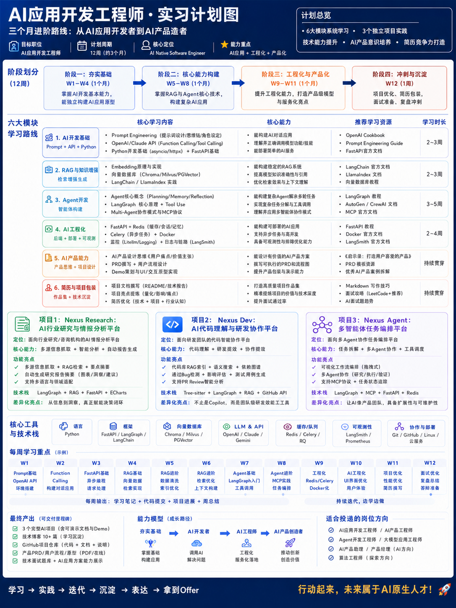

# Nexus AI 应用开发工程师实习计划

## 一、三月计划

- **阶段一：夯实基础**：掌握 AI 基础能力，能独立构建 AI 应用原型。
- **阶段二：核心能力构建**：掌握 RAG 和 Agent 核心技术，完成差异化项目。
- **阶段三：提升工程化能力**：打磨产品体验与差异化亮点。
- **阶段四：项目优化与求职冲刺**：项目优化、简历包装、面试准备、投递冲刺。

## 二、六大模块

| 模块 | 学习内容 |
| --- | --- |
| AI 开发基础 | Prompt、OpenAI API、FastAPI |
| RAG 与知识增强 | Embedding、向量数据库、LangChain |
| Agent 开发 | LangGraph、多 Agent、MCP |
| AI 工程化 | Redis、Docker、部署 |
| AI 产品能力 | PRD、用户流程、Demo |
| 简历与项目包装 | GitHub、博客、面试 |

## 三、三大项目

| 项目 | 定位 |
| --- | --- |
| Nexus Research | AI 行业研究与情报分析平台 |
| Nexus Dev | AI 代码理解与研发协作平台 |
| Nexus Agent | 多智能体任务编排平台 |
